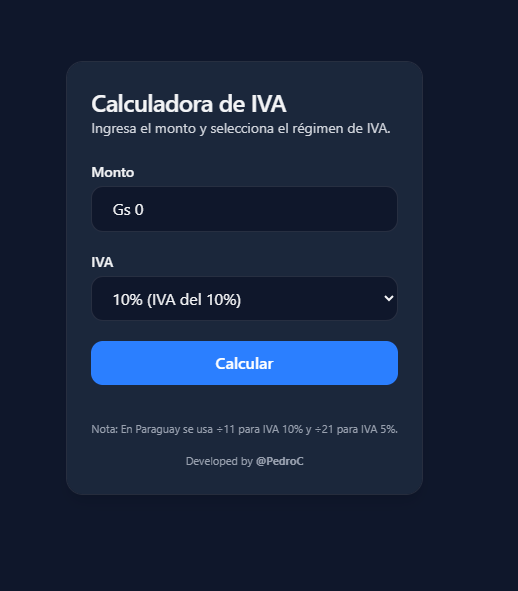
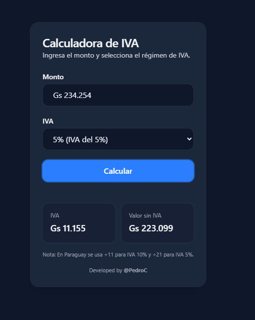

# Calculadora de IVA (Angular + Tailwind)

Pequeña app que **calcula el IVA** y el **monto sin IVA** a partir de un monto ingresado. Optimizada para Paraguay (separador de miles `.` y símbolo de moneda configurable).




---

## ✨ Características

- **Cálculo rápido**: IVA y valor sin IVA.
- **Regímenes soportados**: 10% (÷11), 5% (÷21) y Exenta.
- **Separador de miles** con `.` y decimales con `,` (locale `es-PY`).
- **Máscara de entrada** con `ngx-currency`.
- UI moderna con **Tailwind CSS**.

---

## 🧮 Fórmulas

> En Paraguay se usa **÷11** para IVA del 10% y **÷21** para IVA del 5%.

- **IVA** = `monto / divisor`
- **Valor sin IVA** = `monto - IVA`

Donde `divisor` es:

- 10% → `11`
- 5% → `21`
- Exenta → `0` (el IVA es 0 y el valor sin IVA es el mismo monto).

---

## 🧱 Stack

- Angular (Reactive Forms)
- Tailwind CSS
- [ngx-currency](https://www.npmjs.com/package/ngx-currency)

---

## 🚀 Cómo ejecutar

```bash
# 1) Instalar dependencias
npm install

# 2) Correr en desarrollo
npm start
# o
ng serve -o
```

> Requiere Node y Angular CLI instalados.

---

## ⚙️ Configuración clave

### 1) Símbolos de moneda

```ts
export enum CURRENCY_SYMBOLS {
  PYG = 'Gs',
  BR  = 'Rs'
}
```

Usar en el template: `{{ selectedCurrency }} {{ amount | number:'1.0-0':'es-PY' }}`

### 2) Opciones de IVA (divisores)

```ts
export enum DIVISOR_IVA {
  DIEZ  = 11, // 10%
  CINCO = 21, // 5%
  EXENTA = 0
}

ivaOptions = [
  { value: DIVISOR_IVA.DIEZ,  label: '10% (IVA del 10%)' },
  { value: DIVISOR_IVA.CINCO, label: '5% (IVA del 5%)' },
  { value: DIVISOR_IVA.EXENTA, label: 'Exenta 0%' }
];
```

### 3) Locale para separador de miles

Registrar locale (una vez):

```ts
import { registerLocaleData } from '@angular/common';
import localeEsPy from '@angular/common/locales/es-PY';
registerLocaleData(localeEsPy);
```

Opcional global:

```ts
providers: [{ provide: LOCALE_ID, useValue: 'es-PY' }]
```

### 4) Máscara de moneda (Reactive Forms)

```html
<input
  formControlName="amount"
  currencyMask
  [options]="{
    prefix: selectedCurrency + ' ',
    thousands: '.',
    decimal: ',',
    precision: 0,
    allowNegative: false
  }"
/>
```

---

## 🧪 Uso

1. Ingresá el **monto** (con máscara y puntos de miles).
2. Elegí el **régimen de IVA** (10%, 5% o exenta).
3. Presioná **Calcular**.
4. Se muestran **IVA** y **Valor sin IVA**.

---

## 🖼️ Capturas

Las capturas están en `docs/` y se referencian arriba en el README.

---

## 👤 Autor

Desarrollado por **@PedroC**.

---

## 📝 Licencia

MIT
